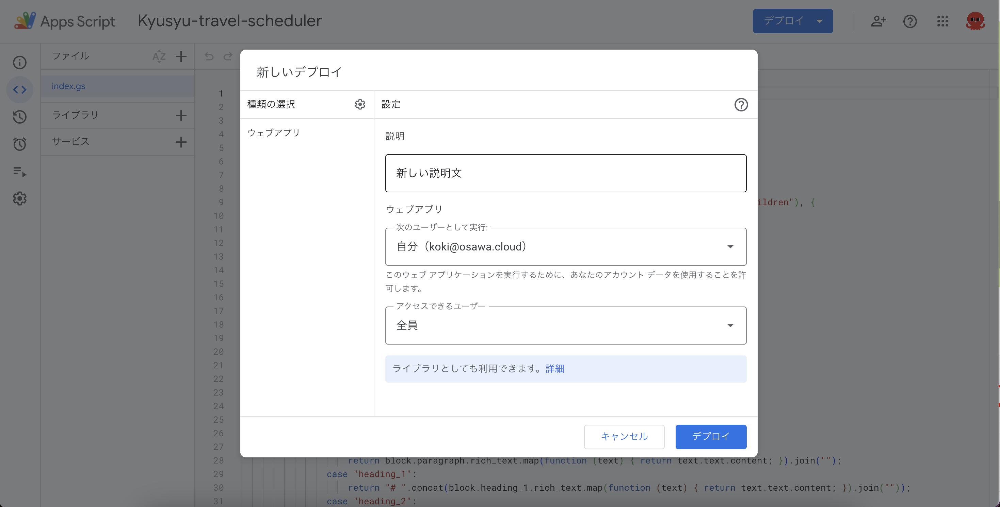

# kyusyu-travel-scheduler

🚰🚰🚰 九州旅行中のスケジュールを管理するためのアプリケーションです！  

[](https://github.com/osawa-koki/kyusyu-travel-scheduler/actions/workflows/ci.yml)
[](https://github.com/osawa-koki/kyusyu-travel-scheduler/actions/workflows/cd.yml)

  

## 準備方法

### 1. Google Apps Script APIの有効化

[Google Apps Script API](https://script.google.com/home/usersettings)を有効化します。  

### 2. Claspのインストール

以下のコマンドでClaspをインストールします。  

```shell
yarn global add @google/clasp
```

### 3. Claspのログイン

以下のコマンドでログインします。  
ブラウザが立ち上がり、Googleアカウントの認証を行います。  

```shell
clasp login
```

### 4. プロジェクトの作成

Node.jsプロジェクトを初期化します。  
また、GASの型定義ファイルをインストールします。  

```shell
yarn init
yarn add -D @types/google-apps-script
```

### 5. Claspプロジェクトの作成

以下のコマンドでClaspプロジェクトを作成します。  

```shell
clasp create
```

### 6. その他イロイロのコマンド

```shell
# ローカルのファイルをGASにアップロード
yarn push

# GASのファイルをローカルにダウンロード
yarn pull

# GASのファイルを開く
yarn open
```

## デプロイ

`cat ~/.clasprc.json`でGASの認証情報を取得します。  
これをGitHubのシークレットに`CLASP_RC_JSON`として登録します。  

`v-*`タグをつけてプッシュすると、GitHub Actionsでプッシュされます。  

これをウェブアプリとしてデプロイします。  

  

また、Slackアプリは`./app-manifest`を使って作成します。  

---

`https://script.google.com/home/projects/<PROJECT_ID>/settings`へアクセスして、スクリプトのプロパティに以下のキーを設定します。  

| キー | 値 |
| --- | --- |
| `NOTION_DATABASE_ID` | NotionのデータベースID |
| `NOTION_SECRET` | Notionシークレット |
| `NOTION_USERNAME_SLACK_ICON_MAPPER` | Notionのユーザー名とSlackのアイコンのマッピングしたデータ(`./notionUsernameSlackIconMapper.json.example`のデータを参照) |
| `SLACK_VERIFICATION_TOKEN` | SlackのVerification Token |
| `SLACK_WEBHOOK_URL` | SlackのWebhook URL |
